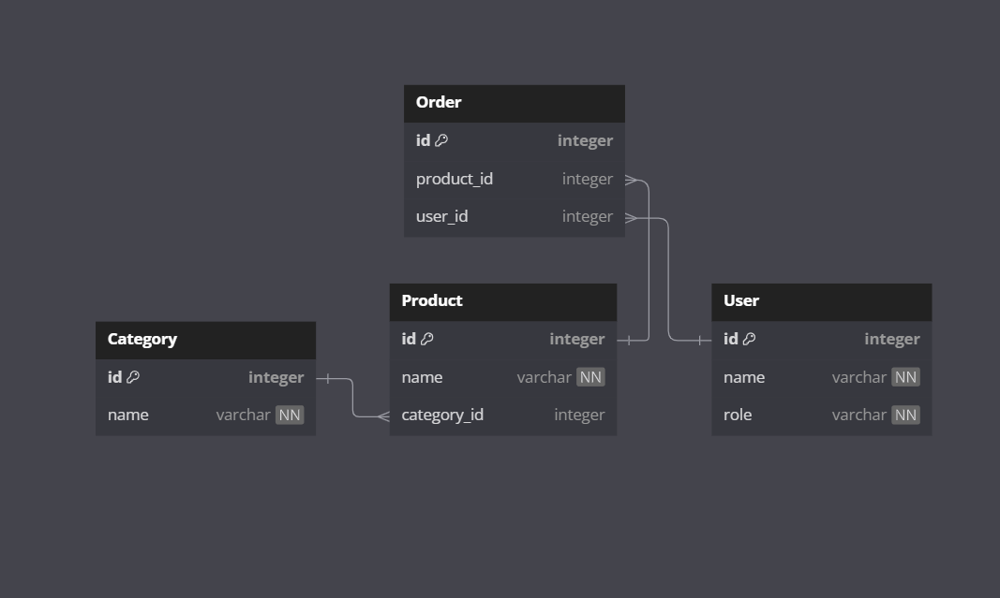

# API Design Document
## Inventory Management System



### API Methods

1. **POST** api/v1/category/add
   - request body : 
   ```json
   {
      "category-name" : "grocery" 
   }
   ```
   - response status : 201
   - response : 
   ```json
   {
      "message" : "Successfully Created category"
   }
   ```

2. **POST** api/v1/product/add
    - request body :
   ```json
    {
      "name" : "pen",
      "price" : 45.87,
      "quantity" : 3,
      "categoryId" : 1
    }
   ```
   - response status : 201
   - response :
   ```json
   {
      "message" : "Successfully created product"
   }
   ```
 
3. **GET**  api/v1/products/{id}
    - path-param-required : false
    - response-status : 200
    - response:product details as JSON
      ```json
      {
        "message" : "Successfully Fetched",
        "products" : [
        {
          "productId": 1,
          "productName": "pen",
          "price": 23.0,
          "quantity": 1,
          "categoryId":1
        }
      ]
      }
      ```
    
4. **GET** api/v1/category/{id}
   - path-param-required:false
   - response-status:200
   - response:product detail by category-id as JSON
   ```json
   {
      "message" : "Successfully fetched",
      "category" : {
        "category-id": 1,
        "category-name":"groceries",
        "products" : ["apple","orange"]
      }
   }
   ```
   
5. **PUT** api/v1/product/{id}/update/?name={product-name}&price={price}&quantity={quantity}
   - path-param-required : false
   - query-param-required : false
   - response-status : 201
   - response :
    ```json
    {
        "message" : "product updated successfully"
    }
   ```
   
6. **DELETE** api/v1/category/{id}/delete
   - path-param-required:true
   - response-status:200
   - response:
     ```json
     {
        "message" : "Successfully deleted category id"
     }
     ```
7. **DELETE** api/v1/product/{id}/delete
   - query-param-required : true
   - response-status:200
   - response:
     ```json
     {
       "message" : "Successfully deleted product id"
     }
     ```

8. **PUT** api/v1/product/{id}/order/?no-of-items={number}
   - path-param-required : true
   - query-param-required : true
   - response-status:200
   - response:
    ```json
    {
        "message" : "product order successfully"
    }
   ```
   
9. **PUT** api/v1/category/{id}/update/?name={name}
   - path-param-required : false
   - query-param-required : false
   - response-status : 200
   - response:
    ```json
    {
        "message" : "category updated successfully"
    }
10. **PUT** api/v1/product/{id}/restock/?no-of-items={number}
   - path-param-required : true
   - query-param-required : true
   - response-status:200
   - response:
   ```json
    {
        "message" : "product restocking successfully"
    }
   ```